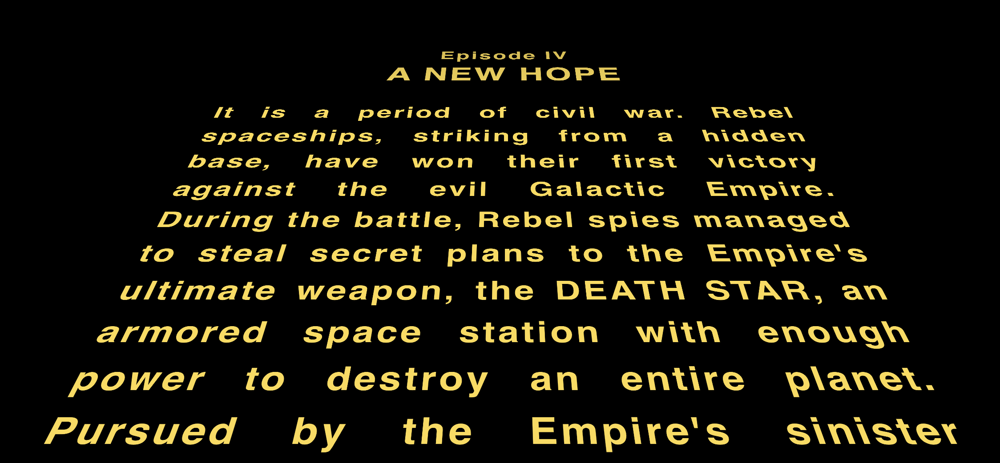

# Star Wars GraphQL Demo



The project demonstrates [Star Wars GraphQL API](https://studio.apollographql.com/public/star-wars-swapi/variant/current/explorer) connection to star wars  to pull in data for star wars opening crawler.

This is a [Next.js](https://nextjs.org) project bootstrapped with [`create-next-app`](https://nextjs.org/docs/app/api-reference/cli/create-next-app).

## Added Dependencies

- [GraphQL Code Generator](https://github.com/dotansimha/graphql-code-generator)
- [Apollo Client](https://github.com/apollographql/apollo-client)
- [Star Wars Crawler](https://www.npmjs.com/package/@liorpo/react-star-wars-crawl)

## Getting Started

First, run the development server:

```bash
npm run dev
# or
yarn dev
# or
pnpm dev
# or
bun dev
```

Open [http://localhost:3000](http://localhost:3000) with your browser to see the result.
